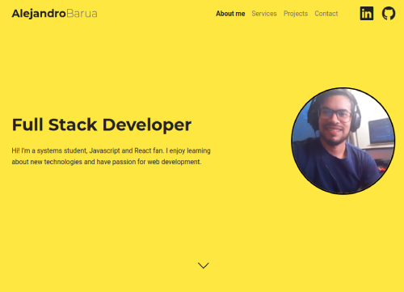
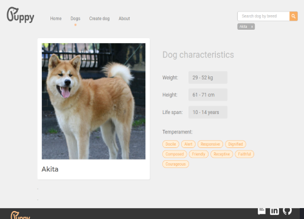
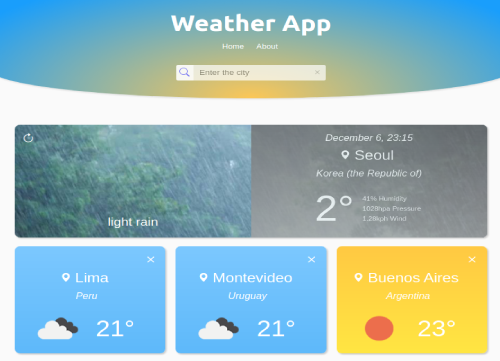
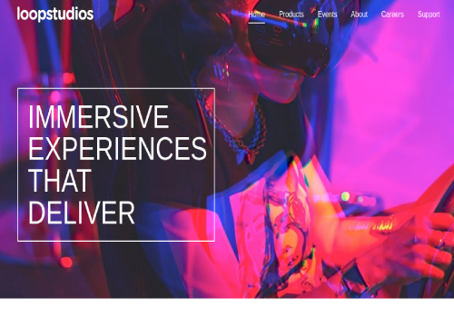
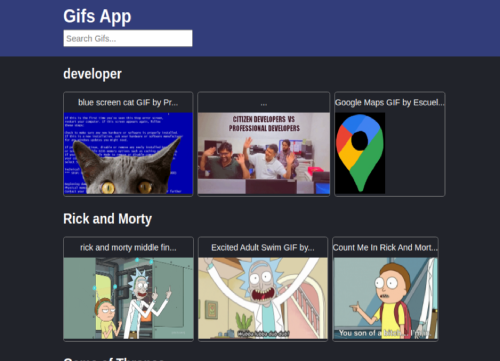
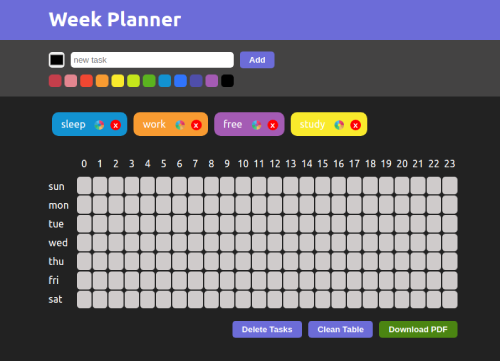
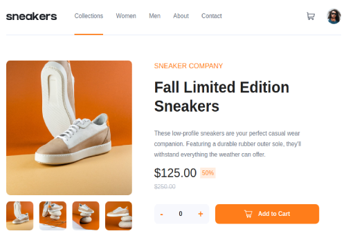
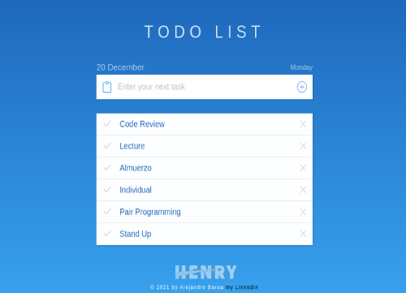

  <h1 align="center">Hi 👋, I'm Alejandro Barua</h1>
  <h3 align="center">A passionate Full Stack Developer from Argentina</h3>

- 🔭 I’m currently working on **Henry Bootcamp**

- 👨‍💻 All of my projects are available at [https://portfolio-alejandrobarua.netlify.app/](https://portfolio-alejandrobarua.netlify.app/)

- 💬 Ask me about **Javascript, React and Node js**

- 📫 How to reach me **alejandrobarua1@gmail.com**

- 💡 Connect with me by Linkedin [https://www.linkedin.com/in/alejandrobarua/](https://www.linkedin.com/in/alejandrobarua/)

<h3 align="left">Languages and Tools:</h3>

 
   
   
   
   
   
   
   
   
   
   
   
   
   
   

## My proyects

 

  
  

  
  
  

  
  
  

&nbsp;